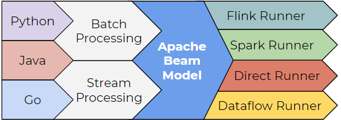

# Apache Beam

## o que é o Apache Beam?

O Apache Beam é um modelo de programação unificado de código aberto para pipelines de processamento de dados em lote e em streaming que simplifica a dinâmica de processamento de dados em grande escala.

### Vantagens ✅

- É uma tecnologia versátil que oferece suporte as seguintes linguagens de programação: Java, Python, Go
- Conta com uma variedade de executores de pipeline (runners), permitindo que os usuários escolham a melhor opção para suas necessidades de execução.
- Capacidade de integrar dados de diversas fontes, proporcionando uma flexibilidade maior no desenvolvimento de pipelines de processamento de dados.

## Arquitetura

### 1. Beam SDK (Software Development Kit)

O SDK do Beam, ou Kit de Desenvolvimento de Software do Beam, é um conjunto de ferramentas e bibliotecas que permite aos desenvolvedores criar pipelines de processamento de dados usando o Apache Beam. Ele fornece APIs para definir fontes de dados, transformações e saídas, além de oferecer suporte para execução em diferentes runners (executores) de pipeline.

### 2. Ferramentas de execução

São os componentes responsáveis por executar os pipelines de processamento de dados definidos com o Apache Beam. Existem diferentes ferramentas de execução disponíveis, como o Direct Runner (para execução local), o Apache Flink, o Apache Spark, o Google Cloud Dataflow, entre outros.

### 3. Fn Runners

São executores específicos para funções (ou "Fn", abreviação de "função") no Apache Beam. Eles são responsáveis por executar transformações personalizadas ou funções definidas pelo usuário dentro dos pipelines. Os Fn Runners são usados para execução distribuída de funções em paralelo dentro do ambiente de execução do Apache Beam.

## Conceitos

### 1. Pipeline

A Pipeline no Apache Bean encapsula toda a sua tarefa de processamento de dados, do início ao fim. Isso inclui a leitura de dados de entrada, a transformação desses dados e a gravação de dados de saída. Todos os programas de driver do Beam devem criar um arquivo Pipeline. Ao criar o Pipeline, você também deve especificar as opções de execução que informam Pipelineonde e como executar.

### 2. PCollection

Um "PCollection" representa um conjunto de dados distribuídos no qual o pipeline do Apache Beam opera. Esse conjunto de dados pode ser limitado, originando-se de uma fonte fixa como um arquivo, ou ilimitado, vindo de uma fonte de atualização contínua. O pipeline geralmente começa com a criação de um "PCollection" lendo dados de uma fonte externa, mas também pode ser criado a partir de dados em memória. Os "PCollections" são as entradas e saídas de cada etapa do pipeline.

### 3. PTransform

A "PTransform" representa uma operação de processamento de dados, ou uma etapa, em seu pipeline. Todo "PTransform" recebe um ou mais PCollection objetos como entrada, executa uma função de processamento que você fornece nos elementos desse PCollectione produz zero ou mais PCollectionobjetos de saída.

Ver a execução: 🔗

###
Temos um exemplo de pipeline de tranformação de dados, que pega dados JSON e o transforma em CSV.
