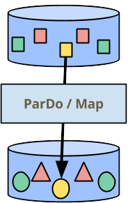
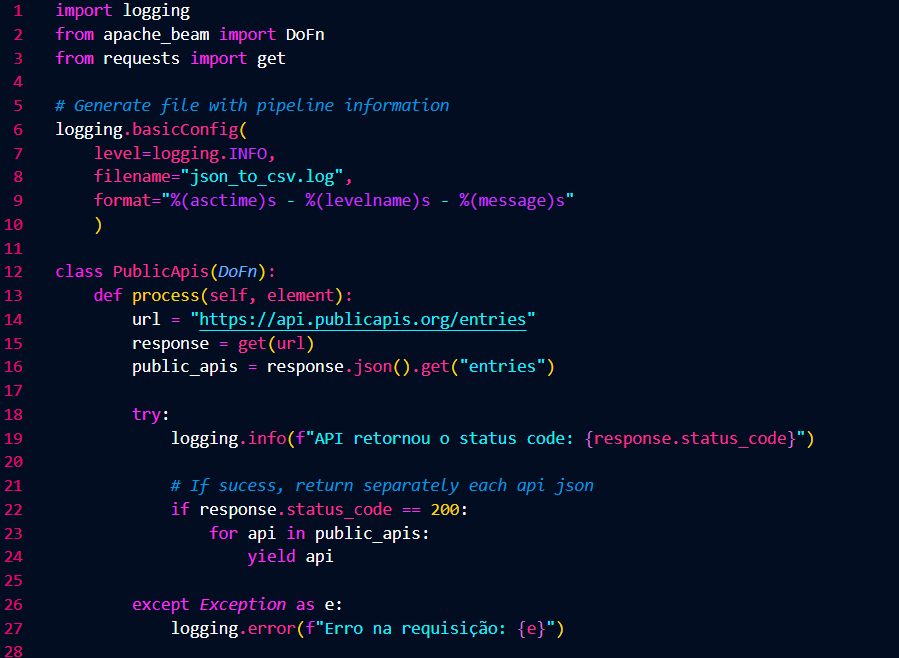

# Explicação da Pipeline de Transformação de dados

Neste documento, vamos discutir sobre a estrutura e funcionamento da pipeline de transformação de dados de JSON para CSV com o Apache Beam. 

## Contexto: 

### API Utilizada:
A [API utilizada](https://api.publicapis.org/entries) contém um inúmeros links para outras APIs públicas e informações sobre elas em um JSON. 

### Função *Pardo* 
A função usada para fazer a requisição para a API é conhecida como ParDo, abreviação de "Parallel Do". 

Essa função é capaz de processar dados em paralelo, o que significa que pode executar várias tarefas ou operações simultaneamente. 
No contexto da pipeline de dados, o ParDo é frequentemente utilizado para aplicar uma transformação em **cada elemento** de um conjunto de dados de forma independente e paralela.



## Instalando as dependências
### Localmente

Clone o projeto:

```bash
  git clone https://github.com/AnaJuliaMM/pipeline_apache_beam.git
```

Crie um ambiente virtual:

```bash
  python -m venv venv
```

Ative o ambiente virtual:

```bash
  .\venv\Scripts\activate
```

Instale os requirements.txt:

```bash
  pip install -r requirements.txt
```
### Com o Docker
Construção da imagem:
```
docker build -t apache-beam-json-to-csv .
```
Para rodar a imagem no Docker:

```
docker run -d apache-beam-json-to-csv
```

## Código e explicação

Este código utiliza o Apache Beam para criar uma pipeline de processamento de dados. A pipeline inclui uma etapa em que os dados são obtidos através de uma função ParDo, que transforma o formato dos dados de JSON para CSV. 

Em seguida, os dados transformados são gravados em um arquivo CSV chamado "public_apis"

### App
1. Cria uma instância da Pipeline Apache Beam
2. Obtém os dados em formato JSON
3. Transforma os dados de JSON para CSV
4. Grava os dados transformados em um arquivo CSV chamado "public_apis"


### ParDo

Este código tem a função PublicApis que estende a classe DoFn, onde realiza uma requisição HTTP para uma API pública, extrai os dados JSON e retorna cada API individualmente para a pipeline do Apache Beam, tratando os erros adequadamente e registrando as informações no log, no arquivo "json_to_csv.log"


### Method
Esse código define uma função chamada json_to_csv_row que é responsável por transformar um objeto JSON em uma linha formatada em formato CSV e retorna essa linha como uma string

Por exemplo, se o objeto JSON fosse:
 {
 "nome": "João",
 "idade": 30,
 "cidade": "São Paulo"
 }

a função retornaria uma string CSV como "João,30,São Paulo"


## Executando o código:
